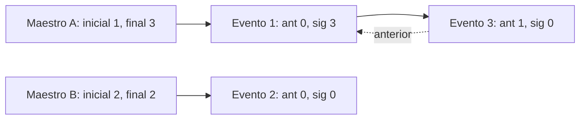

# Datos, bytes y acceso directo

Fuente: `config.py`, `archivos_fijos.py`, `usuarios.py`, `partidas.py` y `colisiones.py`. Revisión del 3 de octubre de 2026. Los offsets empiezan en cero; los registros de datos empiezan en uno.

## Fórmulas y ejemplo resuelto

```text
T = suma de anchos de campos + un espacio por campo + un byte LF
H = T                         (tamaño del encabezado)
offset(n) = H + (n - 1) × T
cantidad = (tamaño_archivo - H) / T
```

La división debe ser exacta. `contar_registros` verifica el resto antes de aplicar `//`. Como H = T, aquí también vale `offset(n) = n × T`; la fórmula general explica qué se está saltando. El encabezado no es el usuario cero.

| Archivo | Campos en orden y anchos en bytes | Espacios | LF | Total |
| --- | --- | ---: | ---: | ---: |
| Maestro | codigo 3, nombre 30, usuario 10, clave 8, inicial 5, final 5 | 6 | 1 | 68 |
| Acumulador | codigo 3, usuario 10, numero 5 | 3 | 1 | 22 |
| Partidas | id 5, codigo 3, numero 5, puntaje_a 6, puntaje_b 6, fecha 19, resultado 8 | 7 | 1 | 60 |
| Colisiones | id 5, codigo 3, usuario 10, numero 5, fecha 19, coordenada 9, evento 15, observacion 40, origen 2, destino 2, anterior 5, siguiente 5 | 12 | 1 | 133 |

Maestro: `3+30+10+8+5+5 + 6 + 1 = 68` bytes. El usuario 3 comienza en `68 + (3-1)×68 = 204` y ocupa hasta el byte 271 inclusive. Su nombre empieza en 208: después de tres bytes de código y un espacio. Con tres usuarios, el archivo mide `(3+1)×68 = 272` bytes.

El evento 3 comienza en `133 + 2×133 = 399`. Un enlace con valor 3 no significa byte 3. La función transforma ese número de registro en offset 399.

## Codificación y lectura

Los números se guardan como dígitos UTF-8 rellenados con ceros, no como enteros binarios de `struct`. Un valor 7 en un campo de cinco bytes se escribe `00007`. Los textos se rellenan con espacios a la derecha. Hay un espacio separador adicional después de cada campo, incluido el último antes del LF.

`codificar` convierte a UTF-8 antes de medir. `José` tiene cuatro caracteres y cinco bytes; no se recortan caracteres para hacerlo entrar. Si un valor supera el ancho o contiene controles como saltos de línea, se rechaza. Los números deben ser enteros no negativos.

`decodificar` separa campos por bytes, convierte los números y elimina relleno de textos. Luego vuelve a codificar para comprobar el formato canónico de ceros y espacios. Esto valida representación; no todas las relaciones de negocio.

`rb` lee bytes. `r+b` lee y sobrescribe un archivo existente. `wb` crea o trunca; la inicialización lo usa solo cuando el archivo falta. El modo binario evita que Windows convierta LF a CRLF y desplace el resto de los registros.

`seek(0, 2)` coloca el cursor al final; `tell()` devuelve la posición. Para leer un registro se calcula su inicio, se hace `seek` y se leen exactamente T bytes. Usar `seek` dentro de un recorrido de todos los registros sigue siendo una búsqueda lineal.

## Tres significados que deben distinguirse

1. **Referencia Python:** una variable permite acceder a un objeto en RAM, administrado por Python.
2. **Cursor de archivo:** posición de lectura/escritura, que cambia con `seek`.
3. **Puntero persistido:** un entero que representa un número de registro relacionado. Los campos inicial, final, anterior y siguiente pertenecen a este caso.

No hay aritmética de direcciones de RAM ni `malloc/free` en este proyecto. Un entero con cinco dígitos en disco no ocupa necesariamente cinco bytes como objeto Python.

## Cadena doble por usuario

El maestro contiene los extremos `inicial` y `final`. Cada colisión contiene `anterior` y `siguiente`. Cero significa ausencia de enlace. Los eventos de usuarios diferentes comparten un archivo y pueden estar intercalados.

Ejemplo ficticio, después de registrar contactos de usuario A, usuario B y nuevamente A:

| ID físico | Usuario | Anterior | Siguiente |
| ---: | --- | ---: | ---: |
| 1 | A | 0 | 3 |
| 2 | B | 0 | 0 |
| 3 | A | 1 | 0 |

A tiene inicial 1 y final 3; B tiene inicial y final 2. Consultar A requiere leer 1 y 3; no leer 2.



Para agregar el evento 3 de A:

1. Leer A y recordar su final, que vale 1.
2. Verificar que el evento 1 pertenece a A y que su siguiente es cero.
3. Agregar el evento 3 con anterior 1 y siguiente 0.
4. Reescribir el evento 1 con siguiente 3; conservar su anterior.
5. Mantener inicial 1 y actualizar final a 3 en el maestro.

Si fuera el primero de A, inicial y final pasarían al nuevo ID. La implementación valida el extremo previo antes de agregar el evento, reduciendo el riesgo de escribir a partir de un enlace conocido como incorrecto.

`historial_usuario` recorre hacia adelante. Aunque existe el enlace anterior, no hay un menú de recorrido inverso. Se valida propietario, ID, anterior, siguiente creciente y extremo final. Eso permite detectar enlaces cruzados o ciclos, pero no repararlos.

## Persistencia y fallos

Estas tres escrituras no forman una transacción. Si se interrumpe después de agregar el nuevo evento, puede quedar sin enlazar. Si se interrumpe antes de guardar el resultado, puede haber eventos sin detalle final. No hay journal, rollback ni recuperación automática. Cerrar un archivo con `with` no transforma varias escrituras en una sola operación atómica.

El contador de inicios se actualiza antes de jugar. Si el juego se interrumpe, el número individual ya consumido no se reutiliza; eso no significa que se conserven todos los movimientos de esa partida.

## Identidades e invariantes

- Código de usuario = posición en el maestro. No hay bajas ni huecos.
- ID de partida o colisión = posición en su propio archivo.
- `(codigo, numero)` identifica la partida individual de un usuario.
- El acumulador tiene un contador global; el número individual se obtiene contando inicios del usuario.
- Una escritura puede reemplazar o agregar inmediatamente al final, pero no dejar huecos.
- Los archivos tienen encabezado exacto y longitud compatible con registros completos.

Ejemplo: A inicia, B inicia, A inicia. Los números globales son 1, 2 y 3; los individuales son A/1, B/1 y A/2. El ID del resultado constituye otra numeración.

`crear_evento` conserva la hora del contacto. `guardar_partida` guarda la hora de escritura del resultado, y la actualiza si reemplaza ese detalle. El acumulador no conserva una hora de inicio.

El ancho de código permite 999 usuarios; cinco dígitos permiten hasta 99999; los puntajes de seis dígitos hasta 999999. Rebasar el ancho provoca error. No existe crecimiento automático del formato; cambiarlo exige migrar registros y offsets.

## Orden físico y presentación

Ordenar físicamente por nombre o puntaje rompería la relación entre posición e identificador. Las consultas ordenan listas en RAM. Guardar una tabla genera un informe legible, no una copia de seguridad restaurable del maestro.

Las columnas del archivo se miden en bytes; `tabla()` mide caracteres con `len`. Esta última medida sirve para el texto español habitual, pero no garantiza el ancho visual de todos los emojis o caracteres combinados.

## Fotografía de la copia revisada

El 3 de octubre de 2026 se observaron 204 bytes en usuarios, 44 en acumulador, 120 en resultados y 7714 en colisiones. Descontando encabezados: 2 usuarios, 1 inicio, 1 resultado y 57 colisiones. No se documentan sus nombres ni claves. Estos conteos cambiarán con el uso.
