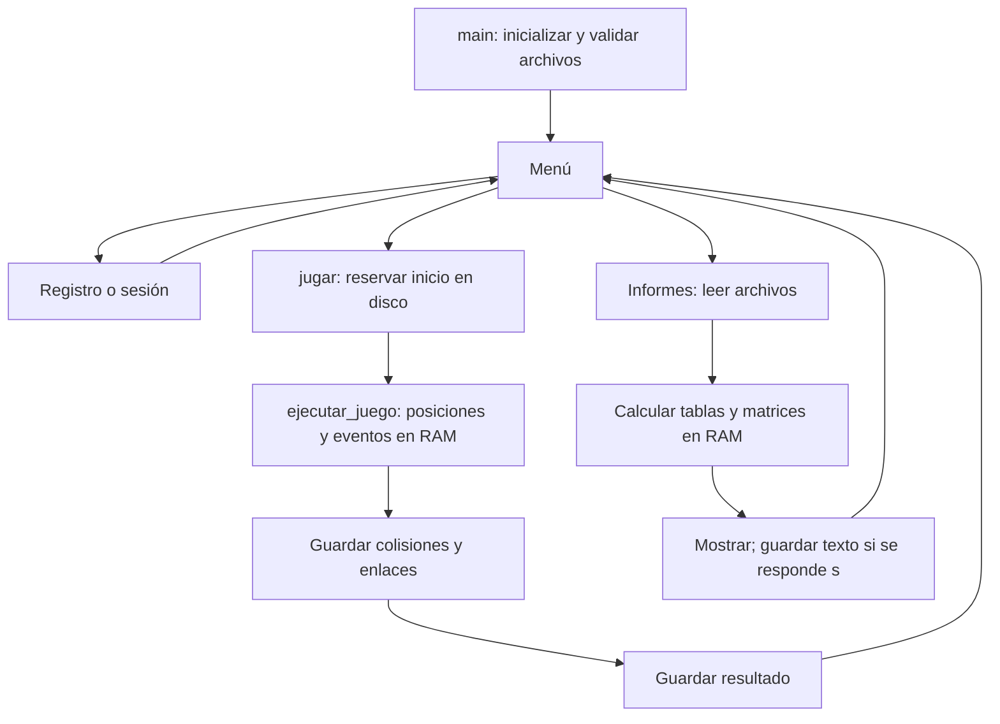

# Guía para comprender y defender el proyecto

Proyecto de cuatro compañeros, con autoría colectiva y uso de IA autorizado. Esta guía explica el código final disponible el 3 de octubre de 2026. Las razones técnicas propuestas deben distinguirse de las motivaciones históricas del grupo, que no pueden deducirse solo leyendo archivos.

## 1. Problema y solución general

El proyecto resuelve dos problemas conectados: ejecutar un juego en tiempo real y conservar datos administrativos para consultarlos después. Hay que decidir cómo se mueve un personaje, qué significa un contacto, cómo cambia el puntaje, a qué usuario pertenece cada evento y cómo encontrarlo después de cerrar el programa.

Una apertura posible para la defensa:

> Desarrollamos en equipo un juego con Python y Pygame y una gestión administrativa con archivos de longitud fija. El juego produce contactos en memoria; al finalizar, guardamos los eventos y el resultado. Cada usuario tiene una cadena enlazada de colisiones. Después usamos esos datos para generar informes y matrices. La IA estuvo permitida como asistencia, y estudiamos las decisiones, verificaciones y límites de la implementación.

Pygame aporta ventana, superficies, eventos, reloj y dibujo. El programa controla su propio bucle y las reglas. La dependencia declarada es `pygame-ce==2.5.8`, que se importa como `pygame`. `random`, `datetime`, `calendar`, `pathlib` y `operator` son módulos de Python. No se observa otro framework ni una base de datos SQL en estos archivos.

## 2. Arquitectura y orden de lectura

| Archivo | Responsabilidad | Funciones o clases para seguir |
| --- | --- | --- |
| `main.py` | Coordinar menú, sesión, juego y guardado | `main`, `jugar` |
| `config.py` | Definir constantes y contratos de campos | `CAMPOS_*`, `tamano_registro` |
| `archivos_fijos.py` | Serializar y acceder a registros | `codificar`, `posicion_registro` |
| `usuarios.py` | Altas, login y acceso al maestro | `registrar_usuario`, `obtener_usuario` |
| `partidas.py` | Reservar inicios y guardar resultados | `nueva_partida`, `guardar_partida` |
| `colisiones.py` | Crear eventos y enlazarlos | `crear_evento`, `guardar_colision`, `historial_usuario` |
| `laberinto.py` | Representar el tablero | `MAPA`, `es_camino` |
| `objetos.py` | Estado y comportamiento de personajes | `Jugador`, `Enemigo` |
| `juego.py` | Entrada, simulación y presentación | `ejecutar_juego` |
| `informes.py` | Consultar, agregar y mostrar | `tabla`, `matriz_*` |

La separación permite estudiar cada responsabilidad. No es absoluta: el juego importa `crear_evento` del módulo de colisiones, aunque esa función solo construye un diccionario y no escribe en disco. Los informes consumen el mismo contrato persistido que producen las partidas.

## 3. Una ejecución completa

1. `main()` llama a `inicializar_archivos()`. Crea archivos faltantes y valida encabezados y representación de los existentes. No comprueba todas las relaciones entre archivos.
2. La variable `sesion` empieza en `None`. Registrar crea un usuario, pero no inicia automáticamente la sesión. Jugar exige una sesión válida.
3. `jugar()` importa la parte gráfica y llama a `nueva_partida(codigo)`. Se guarda un inicio antes de abrir la ventana.
4. `ejecutar_juego()` inicializa Pygame, ventana, reloj, fuente, un jugador, cuatro enemigos y los conjuntos de alimentos.
5. `estado` conserva A, B, el instante de vencimiento del poder y la lista de eventos. La dirección solicitada comienza en `(0, 0)`.
6. Cada vuelta procesa cierre y teclado. La última dirección queda recordada; no es necesario mantener la tecla.
7. Si transcurrieron al menos 140 ms, se mueve al jugador, se consume alimento y se comprueba contacto con enemigos.
8. Si transcurrieron al menos 280 ms, se mueve cada enemigo y se comprueba su contacto antes del siguiente. Esta actualización secuencial permite detectar encuentros en posiciones intermedias.
9. Si no quedan alimentos y no se produjo una derrota, se declara victoria. El cierre de ventana deja el resultado en derrota sin crear un contacto falso.
10. Se acerca la posición visual a la lógica y se dibuja. `tick(60)` limita cuadros, pero no garantiza 60 FPS constantes. Los pasos lógicos usan otros intervalos.
11. El juego devuelve puntajes, resultado y eventos. `finally` ejecuta `pygame.quit()` incluso si ocurre una excepción: libera recursos, no guarda la partida.
12. Después del retorno normal, `main.jugar()` guarda eventos en orden y luego el resultado. Si el juego lanza una excepción, no llega a ese guardado.

Los temporizadores usan `if` y actualizan el último instante a `ahora`. No ejecutan todos los pasos que pudieron perderse durante un cuadro lento: bajo carga la simulación puede avanzar más despacio.

## 4. Programación orientada a objetos

Una clase define estado y comportamiento. `Jugador(7, 1)` construye una instancia. Cada llamada a `Enemigo(...)` crea un objeto distinto con su propio estado. `self` es la referencia a la instancia que recibe el método.

`Jugador` conserva fila, columna, dirección, movimiento y posición visual. `mover` modifica ese estado respetando los caminos. `Enemigo` incorpora inicio, color e identificador de objeto. `reaparecer` restaura su posición inicial y trata de evitar al jugador si ocupa esa celda.

Hay encapsulación como agrupación de datos y métodos, pero los atributos son públicos y se accede a ellos desde otros módulos. No hay una jerarquía propia con herencia de `Personaje`, ni propiedades que controlen todos los cambios.

`actualizar_dibujo(objeto, ...)` funciona con jugador y enemigos porque ambos poseen fila, columna y sus posiciones visuales. Es un caso de interfaz compartida por atributos o *duck typing*. No necesita herencia. En cambio, `Jugador.mover(direccion)` y `Enemigo.mover()` tienen firmas diferentes y no se llaman mediante una interfaz uniforme.

El proyecto combina POO para personajes y programación con funciones para persistencia e informes. No afirmar que utiliza todos los pilares de POO de la misma manera ni que toda función es un método.

## 5. Tablero, vectores y coordenadas

`MAPA` tiene 15 filas y 19 columnas. Es una lista de cadenas; puede consultarse como matriz, pero cada fila es una cadena inmutable. `es_camino` comprueba límites antes de consultar si la celda es una pared.

Las direcciones son tuplas de desplazamiento `(cambio_fila, cambio_columna)`: arriba `(-1,0)`, abajo `(1,0)`, izquierda `(0,-1)` y derecha `(0,1)`. Desde `(7,1)`, derecha conduce a `(7,2)`. Son vectores discretos representados con tuplas, no objetos `pygame.Vector2`.

Hay que distinguir la dirección solicitada en el bucle de `jugador.movimiento`, que indica el movimiento efectivo. Si se pide un giro bloqueado, se conserva el movimiento anterior y se vuelve a intentar el giro en los próximos pasos. Al detenerse por una pared, movimiento pasa a cero; por eso no se repite el evento de pared en cada cuadro. La boca conserva su orientación.

Las colisiones comparan celdas lógicas enteras; no se calculan por superposición de píxeles o rectángulos. La posición visual usa decimales. `avance = milisegundos / duracion_paso`; `acercar` usa `min` o `max` para avanzar sin superar el destino.

Para dibujar, `x = ORIGEN_X + columna * CELDA + CELDA // 2`; la fórmula de y usa fila. Internamente la posición es fila, columna, pero el texto de disco guarda X, Y. Fila 7 y columna 2 se representa `(02 : 07)`.

Los enemigos eligen un vecino transitable mediante `random.choice`. No buscan caminos hacia Pac-Man, ni tienen estrategias diferentes por color. El uso de IA durante el desarrollo no implica IA generativa dentro del juego.

## 6. Estructuras en memoria

| Estructura | Uso | Razón técnica |
| --- | --- | --- |
| Lista | Enemigos y eventos | Conservar varios elementos y su orden |
| Tupla | Coordenadas y direcciones | Representar pares; puede pertenecer a un conjunto |
| Conjunto | Pellets y powers | Evitar duplicados y consultar o retirar posiciones |
| Diccionario | Sesión, registros y estado | Acceder por nombres de campos |
| Listas de listas | Matrices | Representar dimensiones e índices explícitos |
| Instancias | Jugador y enemigos | Asociar estado y comportamiento |

Python administra la memoria de sus objetos. No se asignan o liberan bloques manualmente con `malloc/free`. Una lista contiene referencias a sus elementos; no equivale a un bloque de enteros de tamaño fijo como los registros serializados.

`dict(evento)` crea una copia superficial para añadir ID y enlaces sin agregar esas claves al evento original. Si hubiera valores mutables anidados seguirían compartidos; los campos actuales son escalares.

`crear_matriz` crea cada fila de forma independiente. Si se usara `[[0] * columnas] * filas`, varias filas referenciarían una misma lista; cambiar una celda podría alterar varias filas aparentes. Entender esto conecta matrices con referencias de memoria.

## 7. Memoria RAM y persistencia

| Información | Durante la partida | Momento de escritura |
| --- | --- | --- |
| Posiciones, alimentos y poder | RAM | No se guarda una instantánea para reanudar |
| A, B y eventos actuales | RAM | Al retorno normal del juego |
| Inicio de partida | Acumulador | Antes de abrir el juego |
| Resultados finales | Diccionario y archivo | Después de guardar eventos |
| Matrices y ranking | RAM | Solo el informe de texto si se solicita |

Persistir conserva datos entre ejecuciones normales. No basta para garantizar recuperación ante cortes. Un cierre inesperado puede perder eventos todavía en RAM, y un corte durante el guardado puede dejar una actualización parcial de enlaces. No hay transacciones, journal, `fsync` ni coordinación entre varias instancias.

`with` cierra archivos aunque haya excepciones. `finally` libera Pygame. Son buenas prácticas de recursos, pero no equivalen a rollback ni garantizan persistencia ante un corte eléctrico.

Los punteros persistidos son números de registro; el cursor de archivo es otra cosa, y las referencias Python en RAM son una tercera. Ver [Datos y seek](DATOS_Y_SEEK.md) para el cálculo completo.

## 8. Eventos, puntos y matrices

`PELLET` suma 10 a A; `POWER` activa poder sin sumar puntos directamente; `ENEMIGO_COMIDO` suma 200 a B; `CHOQUE` causa derrota sin poder; `PARED` registra una detención. El evento guarda hora, coordenada, tipo, observación y dos IDs de objeto. Los contactos con fantasmas conservan el ID de su color.

| Matriz | Índices | Dimensiones | Medida |
| --- | --- | --- | --- |
| Contactos | origen−1, destino−1 | 8 × 8 | Un evento en un sentido |
| Calendario | día−1, mes−1 | 31 × 12 | Eventos del año elegido |
| Intervenciones | partida−1, mes−1, objeto−1 | Máximo número seleccionado × 12 × 8 | Participación de cada objeto |

Un contacto con pellet representa **1 evento, 2 participaciones y 10 puntos A**. No son medidas intercambiables. Los IDs 1 a 8 se convierten en índices 0 a 7 restando uno.

La matriz 3D reserva espacio hasta el número máximo seleccionado: los huecos quedan en cero. No limita a 31 partidas. La presentación muestra partidas seleccionadas en doce tablas mensuales, en lugar de 96 columnas juntas.

Las fechas se filtran por evento. Una partida que cruza de año puede aportar eventos a años diferentes. También se incluyen resultados del año sin contactos. `monthrange` permite marcar fechas inexistentes, incluidos años bisiestos.

El calendario compara el total de cada número de día sumando meses, no fechas completas. Los contactos comparan las siete parejas Pac-Man/destino, incluyendo ceros. Los desempates priorizan menor ID o día. Sin actividad no se declara mayor o menor.

Los archivos físicos no se ordenan. Los informes ordenan listas en RAM. El ranking ordena primero por código y número y luego por puntos descendentes; el ordenamiento estable preserva ese desempate. MEJOR y PEOR son filas de resumen y no se suman por segunda vez.

## 9. Costos y decisiones

| Operación | Costo aproximado en registros | Explicación |
| --- | --- | --- |
| Leer usuario por código | O(1) | Offset calculado |
| Login y comprobar username duplicado | O(U) | Recorrido de usuarios |
| Reservar un inicio | O(I) | Cuenta los inicios de ese usuario |
| Agregar colisión | O(1) | Cantidad fija de lecturas y escrituras mediante extremos |
| Historial de usuario | O(Cu) | Recorre sus enlaces y materializa una lista |
| Listar partidas de un usuario | O(P) | Lee el archivo de resultados completo |
| Resumen por usuario | O(U × P) | Recorre partidas por cada usuario |
| Ordenar ranking | O(P log P) | Además de lecturas y consultas |

U = usuarios, I = inicios, Cu = colisiones del usuario, P = resultados. O(1) describe cantidad de accesos, no tiempo de disco nulo. El arranque valida todos los registros existentes.

Los registros fijos facilitan practicar acceso directo y enlaces. A cambio imponen anchos y requieren migrar datos al cambiar campos. El guardado diferido separa simulación y persistencia, pero pierde eventos ante interrupciones. Estas son justificaciones técnicas del diseño; confirmar qué razones guiaron realmente al equipo.

## 10. Preguntas de defensa

1. **¿Por qué `seek`?** Porque un tamaño fijo permite calcular dónde empieza el registro sin leer los anteriores. Buscar username sigue requiriendo recorrido.
2. **¿Por qué el encabezado cuenta?** Ocupa bytes físicos aunque no sea un dato. Omitirlo hace leer la posición anterior.
3. **¿Qué pasa si ordenamos el archivo por puntaje?** Cambian posiciones e invalidan IDs y enlaces. Ordenamos listas para mostrar.
4. **¿Qué pasa si se interrumpe el juego?** El inicio puede existir sin resultado; los eventos en RAM pueden perderse.
5. **¿Qué significa cero?** En los enlaces, ausencia de registro; no identifica al primer usuario.
6. **¿Hay herencia?** No una jerarquía propia; sí clases, instancias, métodos y atributos comunes usados para dibujar.
7. **¿La matriz 3D cuenta dos veces por error?** Cuenta dos participaciones, una por objeto, mientras el conteo de eventos suma una.
8. **¿Es una base de datos?** Es persistencia mediante archivos y relaciones programadas, sin un gestor SQL ni sus transacciones.
9. **¿Toda validación ocurre al iniciar?** No. El arranque valida formato; códigos, posiciones, objetos y cadenas se revisan en otras operaciones.
10. **¿Cuáles son los límites de autenticación?** Claves en texto plano, padrón que las muestra y administración accesible sin rol; es un ejercicio local.

## 11. Cómo estudiar razonando

1. Dibujar desde `main()` hasta el guardado. Marcar cada transición RAM/disco y predecir qué sobrevive si falla en ese punto.
2. Calcular un registro y su tercer offset a mano. Comparar con las funciones.
3. Enlazar en papel eventos alternados de dos usuarios. Actualizar maestro, anterior y siguiente.
4. Explicar un giro bloqueado distinguiendo solicitud, movimiento efectivo y posición visual.
5. Construir dos eventos y sus matrices. Verificar 2 contactos y 4 participaciones.
6. Ensayar una exposición colectiva donde cualquiera pueda explicar cualquier módulo, sin atribuciones individuales.

Ejecutar `python -B tools/verificar_modelo.py` para una comprobación aislada. La documentación permite sostener lo que está implementado; no sustituye practicar predicciones, cambios pequeños en copias y explicación de resultados.
